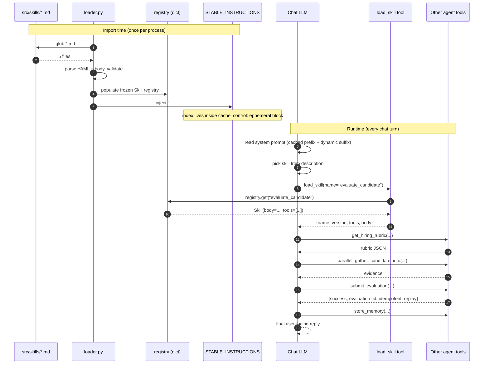
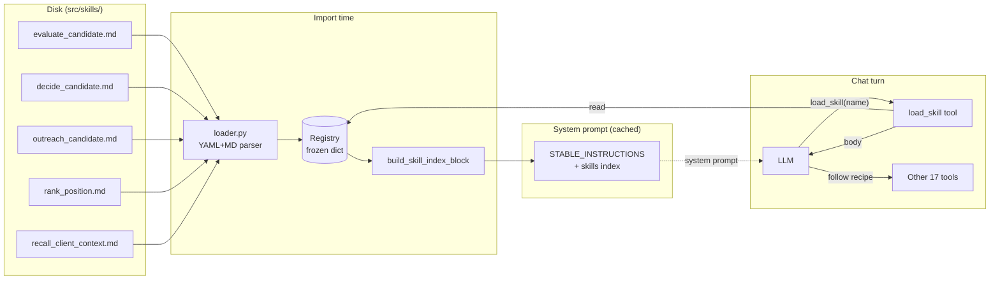

# Plan: Skills Loader (Phase B)

> **Scope**: Add a Claude-Code-style skills mechanism to the HR Recruitment Agent runtime so that multi-step recipes (evaluate, decide, outreach, rank, recall) are loaded on demand instead of inferred by the LLM every turn.
>
> **Frame**: This is a *reasoning-memory* system. Each skill is a pre-written tool-call DAG in English. The LLM stops improvising tool ordering — it follows the recipe verbatim.
>
> **Phase**: Follows the Phase A hardening (commits `7f2b4c8` + `89ec601`).

---

## 1. Why this exists

The recruiter agent today is a single `create_react_agent` instance that decides on each turn:
- which tools to call
- in what order
- when to stop

This is fine for ad-hoc chat but brittle for the seven structured workflows listed in `reliability-diagnostic-action-plan.md`. For Workflow #1 (Candidate Screening) we already moved to a bounded `StateGraph`. For Workflows 2–7 the user explicitly opted *not* to add subgraphs and instead push the procedure into the LLM via a skill — a recipe the model loads on demand and then follows step-by-step.

The win compared to leaving it to free-form reasoning:

| Without skills | With skills |
|---|---|
| Model re-derives "first rubric, then gather, then submit" each turn | Model reads `evaluate_candidate` skill, executes the listed sequence |
| Wrong tool order is the #1 source of `redundant_execution` traces | Tool order is fixed in markdown; model deviation is detectable |
| Long system prompt with all 17 tools documented inline | Stable prompt carries a 5-line index; bodies load on demand |
| Token cost grows linearly with workflow count | Token cost is bounded by the one loaded skill body per turn |

---

## 2. Prior art: how Claude Code does it

Public behavior, verified against Anthropic's Skills docs and the existing `.claude/skills/langfuse/SKILL.md` install in this repo.

**Two-tier loading.** Skills exist to avoid putting every procedure in context at once.

1. **Index tier — always in system prompt.** At session start the runtime scans `.claude/skills/<name>/SKILL.md`, reads only the YAML frontmatter (`name`, `description`, optional `allowed-tools`), and injects a short list into the system prompt:
   ```
   Available skills:
   - langfuse: Operate Langfuse observability for traces and evals
   - pdf-form-filling: Fill out a PDF AcroForm with provided field values
   ```
   That is the *entire* index — descriptions are the contract that helps the model decide *whether* to load a skill, not what's in it.

2. **Body tier — loaded on demand.** When the model decides a skill applies, it calls `Read` on the file path and the full procedure becomes part of the conversation. Only the bodies the model actually loaded stay in context.

**Per-skill schema (frontmatter).**
```yaml
---
name: pdf-form-filling
description: Fill out a PDF AcroForm with provided field values
allowed-tools: Bash, Read, Write
---
```
Body is plain markdown — usually `## When to use`, `## Procedure`, `## Gotchas`, optional `references/*.md` siblings.

**Discovery.** Filesystem scan at startup. Project-local in `./.claude/skills/`, user-level in `~/.claude/skills/`. The `skills-lock.json` already in this repo's root is the lockfile for the `langfuse` skill source hash.

---

## 3. Reasoning-memory framing

What we want is not documentation, it's a **tool-call DAG written in English** that the model executes verbatim. Example:

```markdown
## Procedure
1. Call get_hiring_rubric(position_id=..., client_id=<bound>).
2. Call get_existing_evaluation — if it exists, stop here and report.
3. Call parallel_gather_candidate_info ONCE with all provided URLs.
4. Score using rubric weights.
5. Call submit_evaluation (idempotent, mandatory final tool).
6. Call store_memory(memory_key="eval_summary:<name>", ...).
```

The model is following instructions, not reasoning. Tool order is fixed. Idempotency, client boundary, and audit are already enforced at the tool layer (Phase A), so a recipe that names the right tools is automatically safe.

---

## 4. Design decisions (locked)

These were settled with the user before drafting:

| Decision | Choice | Rationale |
|---|---|---|
| Skill location | `src/skills/<name>.md` flat files | Bundles skills with the loader code; simplest packaging story. No `references/` subdir support — kept intentionally narrow. |
| Selection mechanism | Explicit `load_skill(name)` tool call by the model | Mirrors Claude Code's contract. Cheapest implementation. Skill-selection lives in the model, not in a separate classifier. |
| Initial skill set | `evaluate_candidate`, `decide_candidate`, `outreach_candidate`, `rank_position`, `recall_client_context` | One skill per non-screening workflow from the reliability action plan. Screening already has a bounded StateGraph. |
| Loader timing | Scan once at import, cache forever | Production behavior matches Claude Code. Restart required to pick up SKILL.md edits in prod — acceptable. |

---

## 4a. Architecture

Four moving parts. Two lifecycles — **import-time** (one-shot, runs when the Python module graph loads) and **runtime** (every chat turn).

### Components

| Component | Lives at | Lifecycle | Responsibility |
|---|---|---|---|
| **SKILL files** (`*.md`) | `src/skills/<name>.md` | Static on disk | Source of truth for each recipe. Frontmatter is the contract, body is the procedure. |
| **Loader** (`loader.py`) | `src/skills/loader.py` | Imported once | Globs `*.md`, parses frontmatter+body into frozen `Skill` dataclasses, caches the registry. Fail-soft per file. |
| **Registry** (in-memory dict) | `src.skills.loader._REGISTRY` | Process lifetime | `dict[str, Skill]`. Built lazily on first `get_skill_registry()` call. Never mutated after build. |
| **`load_skill` tool** | `src/skills/tool.py` | Per turn | Agent-facing read of the registry. Pure function, no DB, no network. |
| **Index block** | Injected into `STABLE_INSTRUCTIONS` | Import-time | Short bulleted list of names + descriptions. Lives in the cached half of the system prompt. |

### Lifecycle 1 — import time

```
src.prompts.evaluation
  └─ from src.skills.loader import build_skill_index_block
       └─ get_skill_registry()           # first call
            └─ _load_all(src/skills/)
                 ├─ glob *.md → 5 files
                 ├─ parse YAML frontmatter + markdown body for each
                 ├─ validate required fields (name/description/version)
                 ├─ fail-soft on broken files (warn + skip)
                 └─ return frozen dict[name, Skill]
       └─ build_skill_index_block()      # renders ~6 lines of markdown
       └─ inlined into STABLE_INSTRUCTIONS
       └─ shipped to the LLM inside Phase-A's cache_control: ephemeral block
```

After this point the registry is read-only and the prompt prefix is stable for the entire process. Adding/removing a skill requires a restart, which is by design.

### Lifecycle 2 — runtime (per chat turn)

```
user → /sessions/{id}/chat → build_agent(client_id, session_id)
                                  └─ build_system_prompt_blocks(...)
                                       └─ includes the skills index from import time
                              → agent.invoke({messages:[user_msg]})
                                  ├─ LLM sees system prompt with skill list
                                  ├─ LLM picks a skill from the description
                                  ├─ LLM calls load_skill(name="evaluate_candidate")
                                  │     └─ _wrap_tool sets session_scope(client_id, session_id)
                                  │     └─ load_skill reads registry → returns body
                                  │     └─ result cached in _TURN_TOOL_RESULTS
                                  ├─ LLM follows the body's procedure verbatim
                                  └─ executes tool DAG: get_hiring_rubric → … → submit_evaluation
```

### Mermaid — full lifecycle



### Mermaid — component view



### Where this sits in the bigger picture

```
┌────────────────────────────────────────────────────────────────┐
│  Streamlit (app.py) / FastAPI (server.py)                      │
│      └─ get_or_create_agent → build_agent(client, session)     │
│             ├─ build_chat_model      ← src/llm.py (Phase A)    │
│             ├─ build_system_prompt_blocks                      │
│             │     └─ STABLE_INSTRUCTIONS + skills index ←─┐    │
│             │     └─ cache_control: ephemeral block       │    │
│             ├─ wrap each tool with session_scope          │    │
│             │     + per-turn dedup + sanitizer            │    │
│             └─ create_agent(model, tools, system_prompt)  │    │
│                                                            │    │
│                          ┌─────────────────────────────────┘    │
│                          │ injected at import time             │
│                          ▼                                      │
│                  src/skills/loader.py                           │
│                  ├─ scans src/skills/*.md                       │
│                  ├─ frozen Skill registry                       │
│                  └─ load_skill tool reads from it               │
└────────────────────────────────────────────────────────────────┘
```

---

## 5. File layout

```
src/skills/
├── __init__.py                 # re-exports loader + tool + index builder
├── loader.py                   # Skill dataclass, frontmatter parser, registry
├── tool.py                     # @tool load_skill(name) implementation
├── evaluate_candidate.md       # full screening recipe
├── decide_candidate.md         # shortlist/reject recipe
├── outreach_candidate.md       # email recipe (read-then-send, no preview gate)
├── rank_position.md            # ATS ranking recipe
└── recall_client_context.md    # cross-session memory recall recipe
```

The loader globs `src/skills/*.md` — the `.py` files in the same dir are ignored by extension. No directory-per-skill, no references/.

---

## 6. Skill schema (YAML frontmatter)

```yaml
---
name: evaluate_candidate
description: Run the full HR screening recipe — rubric to evaluation submission with memory write.
version: 1
triggers:
  - "evaluate <candidate>"
  - "score this resume"
  - "is <candidate> a fit for <position>"
tools:
  - get_hiring_rubric
  - get_candidate_by_email
  - get_existing_evaluation
  - parallel_gather_candidate_info
  - submit_evaluation
  - store_memory
---

## When to use
…

## Inputs you need
…

## Procedure
1. …
2. …

## Gotchas
- …
```

**Fields:**

| Field | Required | Used by |
|---|---|---|
| `name` | yes | Registry key + `load_skill(name=…)` arg |
| `description` | yes | Stable-prompt index line; this is what the model uses to *select* a skill |
| `version` | yes | Cache invalidation + trace metadata (`skill_version`) |
| `triggers` | optional | Free-text hints embedded into the index to nudge selection; not used by code |
| `tools` | optional | Advisory list — the recipe should only mention these. Could later be used to scope `allowed_tools` per skill or to grade trace deviations. |

The body is plain markdown. No code execution, no template substitution — the agent reads it as conversation context.

---

## 7. Loader behavior

```python
@dataclass(frozen=True)
class Skill:
    name: str
    description: str
    version: int
    triggers: tuple[str, ...]
    tools: tuple[str, ...]
    body: str          # markdown, not including frontmatter
    source_path: Path  # for debugging / trace metadata
```

**Module-level cache.** `loader.py` keeps a `_REGISTRY: dict[str, Skill] | None`. First call to `get_skill_registry()` triggers `_load_all()`, which:

1. Globs `Path(__file__).parent / "*.md"`.
2. For each file: read text, split frontmatter (`---` … `---`) from body, parse YAML.
3. Validate required fields. Raise `SkillLoadError` on missing `name`/`description`/`version` or duplicate `name`.
4. Stash a frozen `Skill` keyed by `name`.

After first load the registry is read-only for the process lifetime. No file-watching, no reload.

**Failure mode.** If a single skill file is malformed at startup, log a warning and skip it — the rest of the registry still loads. The `load_skill` tool will return `unknown skill` for the skipped name. Better than failing the whole agent.

**Parsing.** YAML via `pyyaml` (already a transitive dep of LangChain). Markdown body is the file contents after the second `---` line, lstripped.

---

## 8. `load_skill` tool

```python
class LoadSkillInput(BaseModel):
    name: str

@tool(args_schema=LoadSkillInput)
def load_skill(name: str) -> dict:
    """Load the full procedure for the named skill.

    Call this BEFORE executing a multi-step workflow. Follow the returned
    procedure verbatim — do not improvise tool ordering when a skill applies.
    """
```

**Return shape:**

```python
# Hit
{
    "name": "evaluate_candidate",
    "version": 1,
    "tools": ["get_hiring_rubric", "submit_evaluation", ...],
    "body": "## When to use\n…",
}

# Miss
{
    "error": "unknown skill: evaluat_candidates",
    "available": ["evaluate_candidate", "decide_candidate", …],
}
```

**Behavior:**

- Pure read from in-memory registry. No DB. No network.
- Tagged via the existing `@traced` decorator with `skill_version` so we can grade deviations against the recipe in trace exports.
- Eligible for the per-turn deterministic tool-result cache already in `src/graph/workflow.py` (since arguments → result is a pure function).
- Tool is added to `ALL_TOOLS` so it's available to both the chat agent and the ATS sub-agent. The screening StateGraph does *not* use it — it has its own deterministic node sequence.

---

## 9. Stable-prompt index

`src/prompts/evaluation.py::STABLE_INSTRUCTIONS` gets a new section appended once, at module import time, built from the registry:

```markdown
## Available skills

Before running a multi-step workflow, call `load_skill(name=<skill>)` and follow
its procedure verbatim. Do not improvise tool ordering when a skill applies.

- `evaluate_candidate` — Run the full HR screening recipe from rubric to evaluation submission.
- `decide_candidate` — Shortlist or reject a candidate with idempotency and audit.
- `outreach_candidate` — Draft and send candidate-facing email with safety checks.
- `rank_position` — Run the ATS ranker across all evaluated candidates for a position.
- `recall_client_context` — Recall prior session preferences for a returning client.
```

This block lives in the *cacheable* part of the system prompt (built once at import, ends up inside the Anthropic `cache_control: ephemeral` block introduced in Phase A). Adding or removing a skill changes the cached prefix → invalidates the cache once, then stable again. Acceptable.

---

## 10. Initial skill bodies (sketches)

### `evaluate_candidate.md` (canonical, longest)
- **When**: User asks to evaluate/score/rate a candidate, or "is X a fit for Y".
- **Procedure (7 steps)**: get_hiring_rubric → get_existing_evaluation (short-circuit if present) → parallel_gather_candidate_info → score → submit_evaluation → store_memory → reply.
- **Gotchas**: never use `query_database` for rubric/candidate lookup; respect parse_resume warnings; never call `write_database` on `evaluations`.

### `decide_candidate.md`
- **When**: User says "shortlist X", "reject X", "move forward with X".
- **Procedure (4 steps)**: confirm candidate exists in client (`get_candidate_by_email` or eval lookup) → confirm prior evaluation exists (`get_existing_evaluation`) → call `shortlist_candidate` or `reject_candidate` with bound `session_id` → reply with idempotent_replay flag if duplicate.
- **Gotchas**: refuse to decide on a candidate with no evaluation row; the tool is already idempotent so don't try to "check first" via query_database.

### `outreach_candidate.md`
- **When**: User asks to email or contact a candidate.
- **Procedure (5 steps)**: confirm candidate in client → fetch prior evaluation for context → draft subject + body grounded in evaluation reasoning → call `send_candidate_email` → reply with email_id and idempotent_replay flag.
- **Gotchas**: never email a candidate without a prior evaluation row; per-tool quota is 5 emails/session — surface the cap if hit; subject hash is part of the idempotency key so resend with different subject is a *new* email.

### `rank_position.md`
- **When**: User asks to rank/sort/compare candidates for a position.
- **Procedure (2 steps)**: call `trigger_ats_ranking(position_id, client_id)` → reply with the ranked list returned by the ATS sub-agent.
- **Gotchas**: this is a thin wrapper — the heavy lifting is inside the ATS sub-agent. Do not pre-fetch all candidates yourself.

### `recall_client_context.md`
- **When**: First turn of a session with a returning client; user asks "what do we know about <client>".
- **Procedure (1 step)**: call `retrieve_memory(client_id=<bound>, session_id=<bound>)` → summarize the returned client_pref / consolidated entries in 1-2 sentences.
- **Gotchas**: don't call `store_memory` inside this skill — it's read-only context recall.

---

## 11. Verification

```bash
# Skills load at import without exception
python -c "from src.skills.loader import get_skill_registry; r = get_skill_registry(); print(sorted(r))"
# Expected: ['decide_candidate', 'evaluate_candidate', 'outreach_candidate', 'rank_position', 'recall_client_context']

# Tool surface
python -c "from src.skills.tool import load_skill; print(load_skill.invoke({'name':'evaluate_candidate'})['version'])"
# Expected: 1

# Unknown skill error path
python -c "from src.skills.tool import load_skill; print(load_skill.invoke({'name':'nope'}))"
# Expected: {'error': 'unknown skill: nope', 'available': [...]}

# Index block is in the cached stable prompt
python -c "from src.prompts.evaluation import STABLE_INSTRUCTIONS; assert 'Available skills' in STABLE_INSTRUCTIONS; assert 'evaluate_candidate' in STABLE_INSTRUCTIONS"

# Tool is registered for the chat agent
python -c "from src.tools import ALL_TOOLS; print([t.name for t in ALL_TOOLS if t.name == 'load_skill'])"
# Expected: ['load_skill']

# Tests
python -m pytest tests/unit/skills/ -x --tb=short
```

---

## 12. Tests to add (one file per concern)

| Test file | Asserts |
|---|---|
| `tests/unit/skills/test_loader.py` | parses a valid SKILL.md; rejects missing `name`; treats duplicate `name` as a single-skill load error (warns, keeps first); ignores `.py` siblings; frozen Skill dataclass |
| `tests/unit/skills/test_tool.py` | `load_skill('evaluate_candidate')` returns body + version + tools; `load_skill('unknown')` returns error with `available` list; result is cacheable (same input → same result identity) |
| `tests/unit/skills/test_prompt_integration.py` | `STABLE_INSTRUCTIONS` contains "Available skills"; contains every registered skill's name and one-line description; does *not* contain skill bodies |
| `tests/unit/skills/test_skill_content.py` | Every shipped skill has `name` matching filename stem, `description` < 200 chars, `version >= 1`, `tools` only references real registered tool names (cross-check against `ALL_TOOLS`) |

All tests are DB-free.

---

## 13. Risks and mitigations

Priority legend: **H** = blocks release / loses correctness or money. **M** = degrades quality, recoverable. **L** = annoyance or long-tail.

| Priority | Risk (one-liner) | Mitigation |
|---|---|---|
| **H** | Model skips `load_skill` and reasons from scratch, defeating the whole point. | Dedicated `SKILLS FIRST` rule in the cached system prompt + cache-friendly Anthropic primary. Add trace-deviation grading later. |
| **H** | Skill body drifts from the real tool surface (renamed tool, removed arg) and the model executes a broken recipe. | `test_skill_content.py` cross-checks every `tools:` frontmatter entry against live `ALL_TOOLS` — typos fail CI. Bump skill `version` whenever the recipe changes. |
| **M** | Hostile user instructs the model to ignore the loaded skill and improvise. | Skill body arrives as a tool result, subject to the existing untrusted-content rule in `STABLE_INSTRUCTIONS`. Phase-A sanitizer also normalises the payload. |
| **M** | Skill description quality determines selection accuracy — vague descriptions cause wrong-skill picks. | Treat descriptions like API contracts. `DESCRIPTION_MAX_CHARS=200` cap enforced in tests so they stay tight and comparable. |
| **M** | Loader fails silently on a malformed `.md` and the skill disappears from the index. | Fail-soft path logs `skill_load_failed` with file + reason; CI-grade `test_real_registry_has_five_skills` catches missing entries. |
| **L** | Cache invalidation after adding/removing/editing any skill. | Acceptable — one warm-up turn after deploy. Skill bodies are NOT in the cached block, so editing a body doesn't invalidate. |
| **L** | Skill goes stale after a tool signature change without a recipe update. | Version field + trace metadata (`skill_version`) makes drift visible in dashboards. Same drift risk as any prompt. |
| **L** | Two contributors create skills with the same `name`. | `_load_all` keeps the first (sorted order) and logs `skill_duplicate_name`; `test_load_all_drops_duplicate_names` regresses this. |

---

## 14. Out of scope (deliberately)

These were considered and pushed out:

- **Intent classifier / auto-injection.** User picked explicit `load_skill` call by the model. Revisit if the hardening sweep shows the model skipping skill loads >10% of the time.
- **`references/<file>.md` sub-files.** Single-file skills only.
- **Per-skill `allowed_tools` enforcement.** The `tools` frontmatter is advisory. Tool-call gating per skill could be added later via the `_wrap_tool` layer in `src/graph/workflow.py`.
- **Skill discovery via filesystem mtime hot-reload.** Cached at import per the user decision. Restart to pick up edits.
- **Skill execution as a deterministic state machine.** Skills remain English instructions to the LLM, not graph nodes. The bounded `StateGraph` exists for Workflow 1 already; the other workflows stay agentic-with-recipes.

---

## 15. Implementation order

| Step | Change | Effort | Impact |
|---|---|---|---|
| 1 | `src/skills/loader.py` + `Skill` dataclass + parser | 0.25 day | foundation |
| 2 | Five `<name>.md` skill files | 0.25 day | content |
| 3 | `src/skills/tool.py` + register in `ALL_TOOLS` | 0.1 day | tool surface |
| 4 | `STABLE_INSTRUCTIONS` index injection in `src/prompts/evaluation.py` | 0.1 day | prompt wiring |
| 5 | Four test files in `tests/unit/skills/` | 0.25 day | regression safety |
| 6 | Smoke: full pytest + manual chat-app turn | 0.1 day | verification |

Total: ~1 day of work. Single commit when done.
